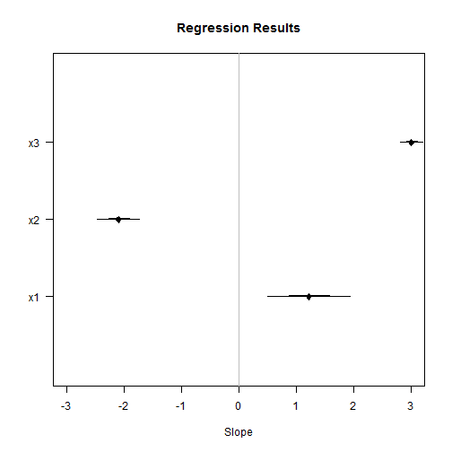

# Regression coefficient plots

From [Thomas Leeper](http://thomasleeper.com/Rcourse/Tutorials/olscoefplot.html).

A contemporary way of presenting regression results involves converting a regression table into a figure.

```r
    set.seed(500)
    x1 <- rnorm(100, 5, 5)
    x2 <- rnorm(100, -2, 10)
    x3 <- rnorm(100, 0, 20)
    y <- (1 * x1) + (-2 * x2) + (3 * x3) + rnorm(100, 0, 20)
    ols2 <- lm(y ~ x1 + x2 + x3)
```

Conventionally, we would present results from this regression as a table:

```r
    summary(ols2)

    ## 
    ## Call:
    ## lm(formula = y ~ x1 + x2 + x3)
    ## 
    ## Residuals:
    ##    Min     1Q Median     3Q    Max 
    ## -53.89 -12.52   2.67  11.24  46.85 
    ## 
    ## Coefficients:
    ##             Estimate Std. Error t value Pr(>|t|)    
    ## (Intercept)  -0.0648     2.6053   -0.02    0.980    
    ## x1            1.2211     0.3607    3.39    0.001 ** 
    ## x2           -2.0941     0.1831  -11.44   <2e-16 ***
    ## x3            3.0086     0.1006   29.90   <2e-16 ***
    ## ---
    ## Signif. codes:  0 '***' 0.001 '**' 0.01 '*' 0.05 '.' 0.1 ' ' 1
    ## 
    ## Residual standard error: 19.1 on 96 degrees of freedom
    ## Multiple R-squared:  0.913,  Adjusted R-squared:  0.91 
    ## F-statistic:  335 on 3 and 96 DF,  p-value: <2e-16

```


Or just:

```r
    coef(summary(ols2))[, 1:2]

    ##             Estimate Std. Error
    ## (Intercept) -0.06483     2.6053
    ## x1           1.22113     0.3607
    ## x2          -2.09407     0.1831
    ## x3           3.00856     0.1006

```

It might be helpful to see the size and significance of these effects as a figure. To do so, we have to draw the regression slopes as points and the SEs as lines.

```r
    slopes <- coef(summary(ols2))[c("x1", "x2", "x3"), 1]  #' slopes
    ses <- coef(summary(ols2))[c("x1", "x2", "x3"), 2]  #' SEs
```


We'll draw the slopes of the three input variables. Note: The interpretation of the following plot depends on input variables that have comparable scales. Note (continued): Comparing dissimilar variables with this visualization can be misleading!

## Plotting Standard Errors

Let's construct a plot that draws 1 and 2 SEs for each coefficient:

We'll start with a blank plot (like a blank canvas):

```r
    plot(NA, xlim = c(-3, 3), ylim = c(0, 4), xlab = "Slope", ylab = "", yaxt = "n")
    # We can add a title:
    title("Regression Results")
    # We'll add a y-axis labelling our variables:
    axis(2, 1:3, c("x1", "x2", "x3"), las = 2)
    # We'll add a vertical line for zero:
    abline(v = 0, col = "gray")
    # Then we'll draw our slopes as points (`pch` tells us what type of point):
    points(slopes, 1:3, pch = 23, col = "black", bg = "black")
    # Then we'll add thick line segments for each 1 SE:
    segments((slopes - ses)[1], 1, (slopes + ses)[1], 1, col = "black", lwd = 2)
    segments((slopes - ses)[2], 2, (slopes + ses)[2], 2, col = "black", lwd = 2)
    segments((slopes - ses)[3], 3, (slopes + ses)[3], 3, col = "black", lwd = 2)
    # Then we'll add thin line segments for the 2 SEs:
    segments((slopes - (2 * ses))[1], 1, (slopes + (2 * ses))[1], 1, col = "black", 
        lwd = 1)
    segments((slopes - (2 * ses))[2], 2, (slopes + (2 * ses))[2], 2, col = "black", 
        lwd = 1)
    segments((slopes - (2 * ses))[3], 3, (slopes + (2 * ses))[3], 3, col = "black", 
        lwd = 1)
```





## Plotting Confidence Intervals

We can draw a similar plot with confidence intervals instead of SEs.


```r
    plot(NA, xlim = c(-3, 3), ylim = c(0, 4), xlab = "Slope", ylab = "", yaxt = "n")
    title("Regression Results")
    axis(2, 1:3, c("x1", "x2", "x3"), las = 2)
    abline(v = 0, col = "gray")
    points(slopes, 1:3, pch = 23, col = "black", bg = "black")
    # Then we'll add thick line segments for each 67% CI: Note: The `qnorm`
    # function tells us how much to multiple our SEs by to get Gaussian CIs.
    # Note: We'll also use vectorization here to save having to retype the
    # `segments` command for each line:
    segments((slopes - (qnorm(0.835) * ses)), 1:3, (slopes + (qnorm(0.835) * ses)), 
        1:3, col = "black", lwd = 3)
    # Then we'll add medium line segments for the 95%:
    segments((slopes - (qnorm(0.975) * ses)), 1:3, (slopes + (qnorm(0.975) * ses)), 
        1:3, col = "black", lwd = 2)
    # Then we'll add thin line segments for the 99%:
    segments((slopes - (qnorm(0.995) * ses)), 1:3, (slopes + (qnorm(0.995) * ses)), 
        1:3, col = "black", lwd = 1)
```


![plot of chunk unnamed-chunk-6](data:image/png;base64,iVBORw0KGgoAAAANSUhEUgAAAfgAAAH4CAMAAACR9g9NAAAAdVBMVEX9/v0AAAAAADkAAGUAOTkAOY8AZrU5AAA5ADk5AGU5OY85j9plAABlADllAGVlZjllZmVltbVltf2POQCPOTmPjzmPtY+P2/21ZgC1jzm1tWW1/rW1/tq1/v2+vr7ajzna/tra/v39tWX924/9/rX9/tr9/v0h5Qg1AAAAJ3RSTlP//////////////////////////////////////////////////wCDVpfZAAAACXBIWXMAAAsSAAALEgHS3X78AAAMaklEQVR4nO2cbV/aaBpHN7pip1hnVrsDu12HEZDv/xE3CWIVtRXzt3C4znlhFLxPHg53EvyV/mMlJfnHvjdA9oPhi2L4ohi+KIYviuGLYviiGL4ohi+K4Yti+KIYviiGL4rhi2L4ohi+KIYviuGLYviiGL4ohi+K4Yti+KIYviiGL8pxhF9eNB2nN+8Z+tqot0jXo6dXu6933xxV+Obs9hdL+/DTxvB7Yj3x1l9nbasuxN11c/rt4uz27vrk9+Zk8vD44nw9i++X3weNuzGn/32Y4y9J7we1v9eNPLttn/3fdfvc6EFL4ejCT/tZOu66N80/z7vw/azdPL6ex12yzfJh0Gg9qPvmFelm0PPwm2f2exx24FjCN/fFFm3qfkIuzts2sz5SF/LR4+s6m2UXdnHenhGWFyeT9nfHq3mzeeYF6fqpx+HXp/rNMxiOKnx7Mp6vY51M5l3u5fpUP3n0eP+rfbbm4VTf/277Krnqf7cb9Ip0M+h5+M0zGI4l/OlNe+jHbwjfX4wfLbfC3wd9RboZ9Dz8g5bC8YTvDv2jU+6jU32X4+mpeHMf3i63TvVb4bekm0HtJeGqlz+9qyfd3h9R+LbEw33Y/T3d+uaun4ebx/uZ2XSx18utm7vt8E+lm0EPD2xGjx6eoXBM4de3cdP7u+v2LL15O9efgDePd4nW54B+uf12bjv8U+lmcHdJ/9fmVN8+uH5NgM70RxL+NeakN1i/lqMNf39PPt73dhwqRxt+fSs+2vdWHCzHG15+iOGLYviiGL4ohi+K4Yti+KIYviiGL4rhi2L4ohi+KIYviuGLYviiGL4ohi+K4Yti+KIYvihDwjfHxV/73oAwHxh+wNgD5K99b0AWw78Vw4fUNAwfUtMwfEhNw/AhNQ3Dh9Q0DB9S0zB8SE3D8CE1DcOH1DQMH1LTMHxITcPwITUNw4fUNAwfUtMwfEhNw/AhNQ3Dh9Q0DB9S0zB8SE3D8CE1DcOH1DQMH1LTMHxITcPwITUNw4fUNAwfUtMwfEhNw/AhNQ3Dh9Q0DB9S0zB8SE3D8CE1DcOH1DQMH1LTMHxITcPwITUNw4fUNAwfUtMwfEhNw/AhNQ3Dh9Q0DB9S0zB8SE3D8CE1DcOH1DQMH1LTMHxITcPwITUNw4fUNAwfUtMwfEhNw/AhNQ3Dh9Q0DB9S0zB8SE3D8CE1DcOH1DQMH1LTMHxITcPwITUNw4fUNAwfUtMwfEhNw/AhNQ3Dh9Q0DB9S0zB8SE3D8CE1DcOH1DQMH1LTMHxITcPwITUNw4fUNAwfUtMwfEhNw/AhNQ3Dh9Q0DB9S0zB8SE3D8CE1DcOH1DQMH1LTMHxITcPwITUNw4fUNAwfUtMwfEhNw/AhNQ3Dh9Q0DB9S0zB8SE3D8CE1DcOH1DQM/wLzpjm92VFNgx6++eGP27wt/OK3m9Vs9JM10YGHb5qnPYaGn47vk3fxt1a104YdPMjwzWsMDr+8/HbZF/8+47/Ljwpa+Febv6nOz0/1s2bcfl2cn0yerfm9m3yY0MJ/58Xgg8MvPq2LL79slzf8AfFskg8OP/1jdP/N1fa6dtguAOzw8Zu7xee/v07mZ7fO+EMn+3bu7vpq1WafNY3XeBb+5e6tGD6kpmH4kJqG4UNqGoYPqWkYPqSmYfiQmobhQ2oahg+paRg+pKZh+JCahuFDahqGD6lpGD6kpmH4kJqG4UNqGoYPqWkYPqSmYfiQmobhQ2oahg+paRg+pKZh+JCahuFDahqGD6lpGD6kpmH4kJqG4UNqGoYPqWkYPqSmYfiQmobhQ2oahg+paRg+pKZh+JCahuFDahqGD6lpGD6kpmH4kJqG4UNqGoYPqWkYPqSmYfiQmobhQ2oahg+paRg+pKZh+JCahuFDahqGD6lpGD6kpmH4kJqG4UNqGoYPqWkYPqSmYfiQmobhQ2oahg+paRg+pKZh+JCahuFDahqGD6lpGD6kpmH4kJqG4UNqGoYPqWkYPqSmYfiQmobhQ2oahg+paRg+pKZh+JCahuFDahqGD6lpGD6kpmH4kJqG4UNqGoYPqWkY/gUW501ztaP67RzGK8jwz1l+mawWnya7qd9K05IxDcPwT5iOV7PRfNR9tz3l35Gr2Ynd/UMw/BOWl98ub/pvvmxm/DvC7BZ8P/0N/5RZM+4Wd9fjHdU/5jBm+WMM/5T1tX158ay71/iDZnD46R+j7q7+2T197mbc8B/B0PCLz39/nbzY3bdzB83A8HfXV6v52X/6y2/grv6QMXxITcPwITUNw4fUNAwfUtMwfEhNw/AhNQ3Dh9Q0DB9S0zB8SE3D8CE1DcOH1DQMH1LTMHxITcPwITUNw4fUNAwfUtMwfEhNw/AhNQ3Dh9Q0DB9S0zB8SE3D8CE1DcOH1DQMH1LTMHxITcPwITUNw4fUNAwfUtMwfEhNw/AhNQ3Dh9Q0DB9S0zB8SE3D8CE1DcOH1DQMH1LTMHxITcPwITUNw4fUNAwfUtMwfEhNw/AhNQ3Dh9Q0DB9S0zB8SE3D8CE1DcOH1DQMH1LTMHxITcPwITUNw4fUNAwfUtMwfEhNw/AhNQ3Dh9Q0DB9S0zB8SE3D8CE1DcOH1DQMH1LTMHxITcPwITUNw4fUNAwfUtMwfEhNw/AhNQ3Dh9Q0DB9S0zB8SE3D8CE1DcOH1DQMH1LTMHxITcPwITUNw4fUNAwfUtMwfEhNw/AvsvjtZkc1jWz4vR+cUPh5c2r4HWiafR+doeGn49VstJqe/OmM72p+EB+wO0PDLy+/XXbJH53qP3Jz98gL4T+u9Me/Dgaf6mfNuFt4jX+NX9/0bZv146d/Hn7xadIvDL8DvzTxK5vw46d/Hn76x6hbGH4n+OEXn//+2k15w+/G3g/OwPB311er+dmt4XH4l7u3YviQmobhQ2oahg+paRg+pKZh+JCahuFDahqGD6lpGD6kpmH4kJqG4UNqGoYPqWkYPqSmYfiQmobhQ2oahg+paRg+pKZh+JCahuFDahqGD6lpGD6kpmH4kJqG4UNqGoYPqWkYPqSmYfiQmobhQ2oahg+paRg+pKZh+JCahuFDahqGD6lpGD6kpmH4kJqG4UNqGoYPqWkYPqSmYfiQmobhQ2oahg+paRg+pKZh+JCahuFDahqGD6lpGD6kpmH4kJqG4UNqGoYPqWkYPqSmYfiQmobhQ2oahg+paRg+pKZh+JCahuFDahqGD6lpGD6kpmH4kJqG4UNqGoYPqWkYPqSmYfiQmobhQ2oahg+paRg+pKZh+JCahuFDahqGD6lpGD6kpmH4kJqG4UNqGoYPqWkYPqSmYfiQmobhQ2oahg+paRg+pKZh+JCahuFDahqGD6lpGD6kpmH4kJqG4UNqGoYPqWkYPqSmYfiQmobhQ2oahg+paRg+pKZh+JCahuFDahqGD6lpGD6kpmH4kJqG4d+sPi7+2vcGhPm48NuvA8eDxhu+6HjDFx1v+KLjDV90vOGLjjd80fHB8ELC8EUxfFEMXxTDF8XwRTF8UQxfFMMXxfBFyYWfN83pzYDxi/OmuRq0BYvf3r/+5UVzdru3tQ/f+52Pfix8t9+z0fvHL79MVotPkwFbMB/wwru7vhq09cPWPnzvdz/60VP9kBf9fNR+mQ540U9P/nz/6peXN8Om7KC1B/Z+tevRj4YfNmfWr/sBDCi3+Hy7x7WvGbj+/c34xfnJsC2/ux4P24D3H/r52d7DD9z7XY9+JPy0aUbd8r2Hbj1+efHePb9fP3rGv3/vHww7bX/27dyQq9TifNglbtChH3yNH35XP3Tvdzz6sfBDT5aBPR9w6Lvz7MA7lEHhh+797kc/N+NnTTPkGj/rP/0xaPfB7+MH7/3OR9+/3BXF8EUxfFEMXxTDF8XwRTF8UQxfFMMXxfBFMXxRDF8UwxfF8EUxfFEMXxTDF8XwRTF8UQxflMrhlxf9Jw0HfwQGSeHwy4ur1Wp2dmv4YvTBl18m3bKd/O3cX17+u/9HyuufjpvC4e+u1/+Svgs/HXefSVhenN3OT/ufhn7+8+ApHL7/3wTaCd6G7z5B1c797uR/93XSfSSle+SoKR2+ZfGpO9V3k/6++Gp61d30DfpUEIHC4fv/jKDt/GjGt+G7/sc+2zsKh+/v6u9v7jbX+FH/8cP1T/vevo+lcPj+ffz6Gr+5q//y++au/tjP9KXDP2Pof0ZCwvCPMLwcPYYviuGLYviiGL4ohi+K4Yti+KIYviiGL4rhi2L4ohi+KIYviuGLYvii/B9k7Ix9qSdlKwAAAABJRU5ErkJggg==)


Both of these plots are similar, but show how the size, relative size, and significance of regression slopes can easily be summarized visually.

Note: We can also extract confidence intervals for our model terms directly using the `confint` function applied to our modle object and then plot those CIs using `segments`:

```r
    ci67 <- confint(ols2, c("x1", "x2", "x3"), level = 0.67)
    ci95 <- confint(ols2, c("x1", "x2", "x3"), level = 0.95)
    ci99 <- confint(ols2, c("x1", "x2", "x3"), level = 0.99)
```


Now draw the plot:

```r
    plot(NA, xlim = c(-3, 3), ylim = c(0, 4), xlab = "Slope", ylab = "", yaxt = "n")
    title("Regression Results")
    axis(2, 1:3, c("x1", "x2", "x3"), las = 2)
    abline(v = 0, col = "gray")
    points(slopes, 1:3, pch = 23, col = "black", bg = "black")
    # add the confidence intervals:
    segments(ci67[, 1], 1:3, ci67[, 2], 1:3, col = "black", lwd = 3)
    segments(ci95[, 1], 1:3, ci95[, 2], 1:3, col = "black", lwd = 2)
    segments(ci99[, 1], 1:3, ci99[, 2], 1:3, col = "black", lwd = 1)
```


![plot of chunk unnamed-chunk-8](data:image/png;base64,iVBORw0KGgoAAAANSUhEUgAAAfgAAAH4CAMAAACR9g9NAAAAdVBMVEX9/v0AAAAAADkAAGUAOTkAOY8AZrU5AAA5ADk5AGU5OY85j9plAABlADllAGVlZjllZmVltbVltf2POQCPOTmPjzmPtY+P2/21ZgC1jzm1tWW1/rW1/tq1/v2+vr7ajzna/tra/v39tWX924/9/rX9/tr9/v0h5Qg1AAAAJ3RSTlP//////////////////////////////////////////////////wCDVpfZAAAACXBIWXMAAAsSAAALEgHS3X78AAAMaUlEQVR4nO2cbV/aaBpHN7pip1hnVrsDu12HEZDv/xE3CWIVtRXzt3C4znlhFLxPHg53EvyV/mMlJfnHvjdA9oPhi2L4ohi+KIYviuGLYviiGL4ohi+K4Yti+KIYviiGL4rhi2L4ohi+KIYviuGLYviiGL4ohi+K4Yti+KIYviiGL8pxhF9eNB2nN+8Z+tqot0jXo6dXu6933xxV+Obs9hdL+/DTxvB7Yj3x1l9nbasuxN11c/rt4uz27vrk9+Zk8vD44nw9i++X3weNuzGn/32Y4y9J7we1v9eNPLttn/3fdfvc6EFL4ejCT/tZOu66N80/z7vw/azdPL6ex12yzfJh0Gg9qPvmFelm0PPwm2f2exx24FjCN/fFFm3qfkIuzts2sz5SF/LR4+s6m2UXdnHenhGWFyeT9nfHq3mzeeYF6fqpx+HXp/rNMxiOKnx7Mp6vY51M5l3u5fpUP3n0eP+rfbbm4VTf/277Krnqf7cb9Ip0M+h5+M0zGI4l/OlNe+jHbwjfX4wfLbfC3wd9RboZ9Dz8g5bC8YTvDv2jU+6jU32X4+mpeHMf3i63TvVb4bekm0HtJeGqlz+9qyfd3h9R+LbEw33Y/T3d+uaun4ebx/uZ2XSx18utm7vt8E+lm0EPD2xGjx6eoXBM4de3cdP7u+v2LL15O9efgDePd4nW54B+uf12bjv8U+lmcHdJ/9fmVN8+uH5NgM70RxL+NeakN1i/lqMNf39PPt73dhwqRxt+fSs+2vdWHCzHG15+iOGLYviiGL4ohi+K4Yti+KIYviiGL4rhi2L4ohi+KIYviuGLYviiGL4ohi+K4Yti+KIYvihDwjfHxV/73oAwHxh+wNgD5K99b0AWw78Vw4fUNAwfUtMwfEhNw/AhNQ3Dh9Q0DB9S0zB8SE3D8CE1DcOH1DQMH1LTMHxITcPwITUNw4fUNAwfUtMwfEhNw/AhNQ3Dh9Q0DB9S0zB8SE3D8CE1DcOH1DQMH1LTMHxITcPwITUNw4fUNAwfUtMwfEhNw/AhNQ3Dh9Q0DB9S0zB8SE3D8CE1DcOH1DQMH1LTMHxITcPwITUNw4fUNAwfUtMwfEhNw/AhNQ3Dh9Q0DB9S0zB8SE3D8CE1DcOH1DQMH1LTMHxITcPwITUNw4fUNAwfUtMwfEhNw/AhNQ3Dh9Q0DB9S0zB8SE3D8CE1DcOH1DQMH1LTMHxITcPwITUNw4fUNAwfUtMwfEhNw/AhNQ3Dh9Q0DB9S0zB8SE3D8CE1DcOH1DQMH1LTMHxITcPwITUNw4fUNAwfUtMwfEhNw/AhNQ3Dh9Q0DB9S0zB8SE3D8CE1DcOH1DQMH1LTMHxITcPwITUNw4fUNAwfUtMwfEhNw/AhNQ3Dh9Q0DB9S0zB8SE3D8CE1DcOH1DQM/wLzpjm92VFNgx6++eGP27wt/OK3m9Vs9JM10YGHb5qnPYaGn47vk3fxt1a104YdPMjwzWsMDr+8/HbZF/8+47/Ljwpa+Febv6nOz0/1s2bcfl2cn0yerfm9m3yY0MJ/58Xgg8MvPq2LL79slzf8AfFskg8OP/1jdP/N1fa6dtguAOzw8Zu7xee/v07mZ7fO+EMn+3bu7vpq1WafNY3XeBb+5e6tGD6kpmH4kJqG4UNqGoYPqWkYPqSmYfiQmobhQ2oahg+paRg+pKZh+JCahuFDahqGD6lpGD6kpmH4kJqG4UNqGoYPqWkYPqSmYfiQmobhQ2oahg+paRg+pKZh+JCahuFDahqGD6lpGD6kpmH4kJqG4UNqGoYPqWkYPqSmYfiQmobhQ2oahg+paRg+pKZh+JCahuFDahqGD6lpGD6kpmH4kJqG4UNqGoYPqWkYPqSmYfiQmobhQ2oahg+paRg+pKZh+JCahuFDahqGD6lpGD6kpmH4kJqG4UNqGoYPqWkYPqSmYfiQmobhQ2oahg+paRg+pKZh+JCahuFDahqGD6lpGD6kpmH4kJqG4UNqGoYPqWkYPqSmYfiQmobhQ2oahg+paRg+pKZh+JCahuFDahqGD6lpGD6kpmH4kJqG4UNqGoYPqWkY/gUW501ztaP67RzGK8jwz1l+mawWnya7qd9K05IxDcPwT5iOV7PRfNR9tz3l35Gr2Ynd/UMw/BOWl98ub/pvvmxm/O5hduu9pxeA4Z8ya8bd4u56vKP6xxzGLH+M4Z+yvrYvL5519xp/0AwOP/1j1N3VP7unz92MG/4jGBp+8fnvr5MXu/t27qAZGP7u+mo1P/tPf/kN3NUfMoYPqWkYPqSmYfiQmobhQ2oahg+paRg+pKZh+JCahuFDahqGD6lpGD6kpmH4kJqG4UNqGoYPqWkYPqSmYfiQmobhQ2oahg+paRg+pKZh+JCahuFDahqGD6lpGD6kpmH4kJqG4UNqGoYPqWkYPqSmYfiQmobhQ2oahg+paRg+pKZh+JCahuFDahqGD6lpGD6kpmH4kJqG4UNqGoYPqWkYPqSmYfiQmobhQ2oahg+paRg+pKZh+JCahuFDahqGD6lpGD6kpmH4kJqG4UNqGoYPqWkYPqSmYfiQmobhQ2oahg+paRg+pKZh+JCahuFDahqGD6lpGD6kpmH4kJqG4UNqGoYPqWkYPqSmYfiQmobhQ2oahg+paRg+pKZh+JCahuFDahqGD6lpGD6kpmH4kJqG4UNqGoYPqWkYPqSmYfiQmobhQ2oahg+paRj+RRa/3eyoppENv/eDEwo/b04NvwNNs++jMzT8dLyajVbTkz+d8c0Hkt+doeGXl98uu+SPTvUfuLX75Fn4jwz98a+Dwaf6WTPuFl7jX+HXJ33jdv346Z+HX3ya9AvD78AvTfzKJvz46Z+Hn/4x6haG3wl++MXnv792U97wu7H3gzMw/N311Wp+dmt4HP7l7q0YPqSmYfiQmobhQ2oahg+paRg+pKZh+JCahuFDahqGD6lpGD6kpmH4kJqG4UNqGoYPqWkYPqSmYfiQmobhQ2oahg+paRg+pKZh+JCahuFDahqGD6lpGD6kpmH4kJqG4UNqGoYPqWkYPqSmYfiQmobhQ2oahg+paRg+pKZh+JCahuFDahqGD6lpGD6kpmH4kJqG4UNqGoYPqWkYPqSmYfiQmobhQ2oahg+paRg+pKZh+JCahuFDahqGD6lpGD6kpmH4kJqG4UNqGoYPqWkYPqSmYfiQmobhQ2oahg+paRg+pKZh+JCahuFDahqGD6lpGD6kpmH4kJqG4UNqGoYPqWkYPqSmYfiQmobhQ2oahg+paRg+pKZh+JCahuFDahqGD6lpGD6kpmH4kJqG4UNqGoYPqWkYPqSmYfiQmobhQ2oahg+paRg+pKZh+JCahuFDahqGD6lpGD6kpmH4kJqG4UNqGoYPqWkYPqSmYfiQmobhQ2oahg+paRg+pKZh+JCahuFDahqGD6lpGD6kpmH4N6uPi7/2vQFhPi789uvA8aDxhi863vBFxxu+6HjDFx1v+KLjDV90fDC8kDB8UQxfFMMXxfBFMXxRDF8UwxfF8EUxfFFy4edNc3ozYPzivGmuBm3B4rf3r3950Zzd7m3tw/d+56MfC9/t92z0/vHLL5PV4tNkwBbMB7zw7q6vBm39sLUP3/vdj370VD/kRT8ftV+mA17005M/37/65eXNsCk7aO2BvV/tevSj4YfNmfXrfgADyi0+3+5x7WsGrn9/M35xfjJsy++ux8M24P2Hfn629/AD937Xox8JP22aUbd876Fbj19evHfP79ePnvHv3/sHw07bn307N+QqtTgfdokbdOgHX+OH39UP3fsdj34s/NCTZWDPBxz67jw78A5lUPihe7/70c/N+FnTDLnGz/pPfwzaffD7+MF7v/PR9y93RTF8UQxfFMMXxfBFMXxRDF8UwxfF8EUxfFEMXxTDF8XwRTF8UQxfFMMXxfBFMXxRDF8UwxelcvjlRf9Jw8EfgUFSOPzy4mq1mp3dGr4YffDll0m3bCd/O/eXl//u/5Hy+qfjpnD4u+v1v6Tvwk/H3WcSlhdnt/PT/qehn/88eAqH7/83gXaCt+G7T1C1c787+d99nXQfSekeOWpKh29ZfOpO9d2kvy++ml51N32DPhVEoHD4/j8jaDs/mvFt+K7/sc/2jsLh+7v6+5u7zTV+1H/8cP3TvrfvYykcvn8fv77Gb+7qv/y+uas/9jN96fDPGPqfkZAw/CMML0eP4Yti+KIYviiGL4rhi2L4ohi+KIYviuGLYviiGL4ohi+K4Yti+KIYvij/B132i1Wu2g40AAAAAElFTkSuQmCC)

## Comparable effect sizes

One of the major problems (noted above) with these kinds of plots is that in order for them to make visual sense, the underlying covariates have to be inherently comparable. By showing slopes, the plot shows the effect of a unit change in each covariate on the outcome, but unit changes may not be comparable across variables. We could probably come up with an infinite number of ways of presenting the results, but let's focus on two here: plotting standard deviation changes in covariates and plotting minimum to maximum changes in scale of covariates.

### Standard deviation changes in X

Let's recall the values of our coefficients on `x1`, `x2`, and `x3`:

```
    coef(summary(ols2))[, 1:2]

    ##             Estimate Std. Error
    ## (Intercept) -0.06483     2.6053
    ## x1           1.22113     0.3607
    ## x2          -2.09407     0.1831
    ## x3           3.00856     0.1006

```

On face value, `x3` has the largest effect, but what happens when we account for different standard deviations of the covariates:

```
    sd(x1)

    ## [1] 5.311

    sd(x2)

    ## [1] 10.48

    sd(x3)

    ## [1] 19.07

```

`x1` clearly also has the largest variance, so it may make more sense to compare a standard deviation change across the variables. To do that is relatively simple because we're working in a linear model, so we simply need to calculate the standard deviation of each covariate and multiply that by the respective coefficient:

```r
    c1 <- coef(summary(ols2))[-1, 1:2]  # drop the intercept
    c2 <- numeric(length = 3)
    c2[1] <- c1[1, 1] * sd(x1)
    c2[2] <- c1[2, 1] * sd(x2)
    c2[3] <- c1[3, 1] * sd(x3)
```


Then we'll get standard errors for those changes:

```r
    s2 <- numeric(length = 3)
    s2[1] <- c1[1, 2] * sd(x1)
    s2[2] <- c1[2, 2] * sd(x2)
    s2[3] <- c1[3, 2] * sd(x3)

```

Then we can plot the results:

```r
    plot(c2, 1:3, pch = 23, col = "black", bg = "black", xlim = c(-25, 65), ylim = c(0, 
        4), xlab = "Slope", ylab = "", yaxt = "n")
    title("Regression Results")
    axis(2, 1:3, c("x1", "x2", "x3"), las = 2)
    abline(v = 0, col = "gray")
    # Then we'll add medium line segments for the 95%:
    segments((c2 - (qnorm(0.975) * s2)), 1:3, (c2 + (qnorm(0.975) * s2)), 1:3, col = "black", 
        lwd = 2)
    # Then we'll add thin line segments for the 99%:
    segments((c2 - (qnorm(0.995) * s2)), 1:3, (c2 + (qnorm(0.995) * s2)), 1:3, col = "black", 
        lwd = 1)
```


![plot of chunk unnamed-chunk-13](data:image/png;base64,iVBORw0KGgoAAAANSUhEUgAAAfgAAAH4CAMAAACR9g9NAAAAhFBMVEX9/v0AAAAAADkAAGUAOTkAOY8AZrU5AAA5ADk5AGU5OWU5OY85j9plAABlADllAGVlOQBlOY9lZjllZmVltbVltf2POQCPOTmPZgCPjzmPtY+P29qP2/21ZgC1jzm1tWW1/rW1/tq1/v2+vr7ajzna/tra/v39tWX924/9/rX9/tr9/v3fetGiAAAALHRSTlP/////////////////////////////////////////////////////////AMfWCYwAAAAJcEhZcwAACxIAAAsSAdLdfvwAAAnCSURBVHic7dxhW9pYHkDxubqgXVF3pwvu7sBMl1II5Pt/v81NCKNYRSY3huSc86K0YP6m/MhN6CP9JTdkv3S9A9ZNwkMTHprw0ISHJjw04aEJD014aMJDEx6a8NCEhyY8NOGhCQ9NeGjCQxMemvDQhIcmPDThoQkPTXhow4Df3ofY9fKvbPrWVh8ZWm29mJ7/fbtuUPBhtP7koSX8IgjfUdWBV/26KqwixG4Wrr/dj9a72dWv4Wp+uD+7qY7i/e2fG03iNtd/HI7xnw3db1R8XdxytC4e/d+seGx8GNuXBge/KI/SSXQP4W83Eb48auv7q+M4ktW3h43G1UbxN28MrTd6DV8/0vET8fGGAh/2YllBXR6Q2U1hsyqRIuSz+yud+jbCZjfFirC9v5oXXzvJN6F+5CdDq4eew1dLff1IbxoUfLEYbyqsq/kmcm+rpX7+7P7yS0u2cFjqy68tXiXT8mvjRm8MrTd6DV8/0puGAn+9LJ76yQfgy5Pxs9sj+D3oG0PrjV7DH8b2peHAx6f+2ZL7bKmPHC+X4vo6vLg9WuqP4I+G1hsVp4RpOfzlVX2fLu8HBF9IHK7D9td01cVdeRzW95dHZojY1e3Rxd0x/Muh9UaHO+qtx4dH+tKQ4KvLuMX+6rpYpeu3c+UCXN8fiao1oLw9fjt3DP9yaL1xPKX/q17qizur10SPVvqBwL/Vpk9vsD63wcLvr8knXe/HpTZY+OpSfNz1Xlxsw4W3dxMemvDQhIcmPDThoQkPTXhowkMTHprw0ISHJjw04aEJD014aMJDEx6a8NCEh9YEPnTW9+6+dX9qEb7Bts363tl37k/CQxMemvDQhIcmPDThoQkPTXhowkMTHprw0ISHJjw04aEJD014aMJDEx6a8NCEhyY8NOGhCQ9NeGjCQxMemvDQhIcmPDThoQkPTXhowkMTHprw0ISHJjw04aEJD014aMJDEx6a8NCEhyY8NOGhCQ9NeGjCQxMemvDQhIcmPDThoQkPTXhowkMTHprw0ISHJjw04aEJD014aMJDEx6a8NCEhyY8NOGhCQ9NeGjCQxMemvDQhIcmPDThoQkPTXhowkMTHprw0ISHJjw04aEJD014aMJDEx6a8NCEhyY8NOGhpYHfhHC9PHN0ixHhz322k8BnX5b5atx0V9IFhA/hzKe7KfxisieP+GeNbjEEfDjRqc3ff/gk/Pbx22Mp/ucR/9Fv3V4Dhz9F/iH9xkv9KkyKX7Obq/mZo1ts4PA/6fwjrTF8dluJbx+O5YX/vM5fYRvDL77u1/jF9LzRLcaD//yLu+zux9N8M1p7xHfcJ7+d282mecG+CsFzfL/yX+6gCQ9NeGjCQxMemvDQhIcmPDThoQkPTXhowkMTHprw0ISHJjw04aEJD014aMJDEx6a8NCEhyY8NOGhCQ9NeGjCQxMemvDQhIcmPDThoQkPTXhowkMTHprw0ISHJjw04aEJD014aMJDEx6a8NCEhyY8NOGhCQ9NeGjCQxMemvDQhIcmPDThoQkPTXhowkMTHprw0ISHJjw04aEJD014aMJDEx6a8NCEhyY8NOGhCQ9NeGjCQxMeWhr47CaE6Tmj231RCH+6JPDbh3me3c4/PjqEVuWFP11T+MUkX4034/i740P+xehwonP3+92EP11T+O3jt8dl+ZuH+og/wjxF3oK+8KdrvNSvwiTe7GaTj49Of4y/TPjTNYavzu3b+1fuJ+BPDm6Q8KdrDL/4Oo5X9a+u6b24u+yawmd3P57mP3X37dxF1xB+N5vmm9Hv5Un73av6T0340/kvd9CEhyY8NOGhCQ9NeGjCQxMemvDQhIcmPDThoQkPTXhowkMTHprw0ISHJjw04aEJD014aMJDEx6a8NCEhyY8NOGhCQ9NeGjCQxMemvDQhIcmPDThoQkPTXhowkMTHprw0ISHJjw04aEJD014aMJDEx6a8NCEhyY8NOGhCQ9NeGjCQxMemvDQhIcmPDThoQkPTXhowkMTHprw0ISHJjw04aEJD014aMJDEx6a8NCEhyY8NOGhCQ8tFXz2ZXnm6BZ7B767nbqwEsFvwnUv4ENQvqop/GKSr8b54uq/l3rEhxN1tpMd1xR++/jtMZI/W+q7f06/v9yP03W2p93VeKlfhUm86cc5Hsv8usbw2e28vOkP/GfuyeXWGH7xdRxv+gHvxd2hpvDZ3Y+neMj3BN63c3UN4Xezab4ZrfsDb/v8lztowkMTHprw0ISHJjw04aEJD014aMJDEx6a8NCEhyY8NOGhCQ9NeGjCQxMemvDQhIcmPDThoQkPTXhowkMTHprw0ISHJjw04aEJD014aMJDEx6a8NCEhyY8NOGhCQ9NeGjCQxMemvDQhIcmPDThoQkPTXhowkMTHprw0ISHJjw04aEJD014aMJDEx6a8NCEhyY8NOGhCQ9NeGjCQxMemvDQhIcmPDThoQkPTXhowkMTHprw0ISHJjw04aEJD014aMJDEx6a8NCEhyY8NOGhCQ9NeGjCQxMemvDQhIcmPLQ24Tvre3ffuj+1B/+hF0d/pvZnaIqpwvdwqPDQocJDhwoPHSo8dKjw0KF9gLcLTXhowkMTHprw0ISHJjw04aEJD014aG3CZzchTPN8ex9G64RjU89rbUd3s/RDd7NwNU8xtUX47cM8z27n8a+/Gqcbm3peazuar4pXU+qhi2m+Ga0TTG0RfhP3bDHdPi7z7Msy2djU81rb0ezv/5im3ts4Lk/yHLR8ji8OpuxuXR5TqUo9ryr9ju6efiuOy8RDs7t/x6U+wdR24XezSVyZkkKlnlfWwo6uJnFBTjw0uylfSwmmtgS/CGEcL0Em6Y/QNo74Fna0mLZr44hfJ1qc2r2qL65qk5+T05/jW9nRVfmz7ZPU5/h/luKXfY6vns5yFU17VZ92Xms7Wl7Rpx66mFZrSeOpLcJXr/np5b+Pb2tH23gfX4y7Xl74+3i75ISHJjw04aEJD014aMJDEx6a8NCEhyY8NOGhCQ9NeGjCQxMemvDQhIcmPDThoZHht/ch/uRi4p/V7klg+O39NM9Xo7XwsErw+LGU4rb6qeXt43/qDyFfD/3FAIbfzaofTY/wi/Kjc9v70XpzXf4p7Uc2LjAwfJ5vQvnR0y/L+JGk+MmkYvHfPc3jp9L2n0cebmj4ouw2LvXxoN+Lxw/KFxd95ZI/5MDw5f+HUDg/O+IL+Og/9KM9BoYvr+r3F3f1OX5cfqC9+lPX+9duYPjyfXx1jq+v6h9+ra/qh77So+Fflf5/WLnchH+W8Db4hIcmPDThoQkPTXhowkMTHprw0ISHJjw04aEJD014aMJDEx7a/wHa19Fu1tNsigAAAABJRU5ErkJggg==)


By looking at standard deviation changes (focus on the scale of the x-axis), we can see that `x3` actually has the largest effect by a much larger factor than we saw in the raw slopes. Moving the same relative amount up each covariate's distribution produces substantially different effects on the outcome.


### Full scale changes in X

Another way to visualize effect sizes is to examine the effect of full scale changes in covariates. This is especially useful when deal within covariates that differ dramatically in scale (e.g., a mix of discrete and continuous variables). The basic calculations for these kinds of plots are the same as in the previous plot, but instead of using `sd`, we use `diff(range())`, which tells us what a full scale change is in the units of each covariate:

```r

    c3 <- numeric(length = 3)
    c3[1] <- c1[1, 1] * diff(range(x1))
    c3[2] <- c1[2, 1] * diff(range(x2))
    c3[3] <- c1[3, 1] * diff(range(x3))

```


Then we'll get standard errors for those changes:

```r
    s3 <- numeric(length = 3)
    s3[1] <- c1[1, 2] * diff(range(x1))
    s3[2] <- c1[2, 2] * diff(range(x2))
    s3[3] <- c1[3, 2] * diff(range(x3))

```


Then we can plot the results:

```r
    plot(c3, 1:3, pch = 23, col = "black", bg = "black", xlim = c(-150, 300), ylim = c(0, 
        4), xlab = "Slope", ylab = "", yaxt = "n")
    title("Regression Results")
    axis(2, 1:3, c("x1", "x2", "x3"), las = 2)
    abline(v = 0, col = "gray")
    # Then we'll add medium line segments for the 95%:
    segments((c3 - (qnorm(0.975) * s3)), 1:3, (c3 + (qnorm(0.975) * s3)), 1:3, col = "black", 
        lwd = 2)
    # Then we'll add thin line segments for the 99%:
    segments((c3 - (qnorm(0.995) * s3)), 1:3, (c3 + (qnorm(0.995) * s3)), 1:3, col = "black", 
        lwd = 1)
```


![plot of chunk unnamed-chunk-16](data:image/png;base64,iVBORw0KGgoAAAANSUhEUgAAAfgAAAH4CAMAAACR9g9NAAAAdVBMVEX9/v0AAAAAADkAAGUAOTkAOY8AZrU5AAA5ADk5AGU5OY85j9plAABlADllAGVlZjllZmVltbVltf2POQCPOTmPjzmPtY+P2/21ZgC1jzm1tWW1/rW1/tq1/v2+vr7ajzna/tra/v39tWX924/9/rX9/tr9/v0h5Qg1AAAAJ3RSTlP//////////////////////////////////////////////////wCDVpfZAAAACXBIWXMAAAsSAAALEgHS3X78AAAJwUlEQVR4nO3cbVva2BpA4YkOYAs6HegZmNNjqQTy/3/iyU4IAooV8p611ofGgnm6621e6CX9IzFkf7S9AGsn4aEJD014aMJDEx6a8NCEhyY8NOGhCQ9NeGjCQxMemvDQhIcmPDThoQkPTXhowkMTHprw0ISHJjy0YcBvZ1Ho/vmWXS/t9Zmh+d6r+fV/btsNCj4avTQ8NINfRcK3VH7g5b+uU6sAsVtE9z9mo5fd4u6v6G55eDye5Efxfvu60zTsc//fwzH+3tD9TunnhT1HL+mz/1ukz40PY/vS4OBX2VE6De5R9OckwGdHbfF4fhwHsmJ72Gmc7xQ+uDC02OktfPFMu1+HKxoKfLQXi1Pq7ICMJ6nNOkMKkEeP5zrFNsDGk/SMsJ3dLdPPnSabqHjmnaH5U8fw+am+eKY3DQo+PRlvcqy75SZwb/NT/fLo8exTM7bocKrPPjf9Lplnnxt2ujC02OktfPFMbxoK/P1z+qWffgI+uxgfbc/g96AXhhY7vYU/jO1Lw4EPX/qjU+7RqT5wnJ6Ki/vwdHt2qj+DPxta7JReEubZ8NO7+j7d3g8IPpU43Ift7+nym7vsOCwez47MKGDn27Obu3P406HFTocHir3Hh2f60pDg89u41f7uOj1LFy/nshNw8Xggys8B2fb85dw5/OnQYudwSf+7ONWnD+bfEz060w8E/lKbPr3AarbBwu/vyadtr6OrDRY+vxUft72KzjZcePsw4aEJD014aMJDEx6a8NCEhyY8NOGhCQ9NeGjCQxMemvDQhIcmPDThoQkPTXhoZeCjbvWz7QV0rBrhS+xbQz/bXkC3Eh6a8NCEhyY8NOGhCQ9NeGjCQxMemvDQhIcmPDThoQkPTXhowkMTHprw0ISHJjw04aEJD014aMJDEx6a8NCEhyY8NOGhCQ9NeGjCQxMemvDQhIcmPDThoQkPTXhowkMTHprw0ISHJjw04aEJD014aMJDEx6a8NCEhyY8NOGhCQ9NeGjCQxMemvDQhIcmPDThoQkPTXhowkMTHprw0ISHJjw04aEJD014aMJDEx6a8NCEhyY8NOGhCQ9NeGjCQxMemvDQhIcmPDThoQkPTXhowkMTHprw0ISHJjw04aEJD60a+E0U3T9fObrphgVf+otbCXz85TlZj68c3XRDgo/Syo74+Onfwq+me/KAf9Xopus9fHS5W6Z9/PRv4bdPP54y8dcjvsxyaqzP8B+Y36pf+lS/jqbpr/Hkbnnl6KbrM/xZVRxXpeHjh1x8+3guL3xtdeAan6y+jfcfzK8b3XRDgk/ah4+//vq+3IxePOKbre2Xc7vFPEnZ11HkNb5f+S930ISHJjw04aEJD014aMJDEx6a8NCEhyY8NOGhCQ9NeGjCQxMemvDQhIcmPDThoQkPTXhowkMTHprw0ISHJjw04aEJD014aMJDEx6a8NCEhyY8NOGhCQ9NeGjCQxMemvDQhIcmPDThoQkPTXhowkMTHprw0ISHJjw04aEJD014aMJDEx6a8NCEhyY8NOGhCQ9NeGjCQxMemvDQhIcmPDThoQkPTXhowkMTHprw0ISHJjw04aEJD60a+HgSRfMrR9+ynDIJf1Il8NvHZRI/LK8b/d5i0q7e6bMJf1JZ+NU0WY834/DR+SH/KcPo4z4z4pMJf1JZ+O3Tj6fn7IPH4oj/pNpvyCvXF/6k0qf6dTQNm91ieuXod9ZS9UF+kvAnlYbPr+3b2Rt3r/GdrjT86ts43NW/uae/6Q5d+MYqCx9//fV9+a67L+c6XUn43WKebEb/Zhfnm+7qm0v4k/yXO2jCQxMemvDQhIcmPDThoQkPTXhowkMTHprw0ISHJjw04aEJD014aMJDEx6a8NCEhyY8NOGhCQ9NeGjCQxMemvDQhIcmPDThoQkPTXhowkMTHprw0ISHJjw04aEJD014aMJDEx6a8NCEhyY8NOGhCQ9NeGjCQxMemvDQhIcmPDThoQkPTXhowkMTHprw0ISHJjw04aEJD014aMJDEx6a8NCEhyY8NOGhCQ9NeGjCQxMemvDQhIdWFXz85fnK0U33PnzHFtlcFcFvovtewkdRx1bZWGXhV9NkPU5Wd//06IiPLtbi8pquLPz26cdTID861Xf0y5jBXzbv6Kprq/Spfh1Nw6af13gU9Wml4eOHZbbpL3zjK+lEpeFX38Zh0094b+4u9Vv4+Ouv7+GQ7yl81xbZXCXhd4t5shm99Bcem/9yB014aMJDEx6a8NCEhyY8NOGhCQ9NeGjCQxMemvDQhIcmPDThoQkPTXhowkMTHprw0ISHJjw04aEJD014aMJDEx6a8NCEhyY8NOGhCQ9NeGjCQxMemvDQhIcmPDThoQkPTXhowkMTHprw0ISHJjw04aEJD014aMJDEx6a8NCEhyY8NOGhCQ9NeGjCQxMemvDQhIcmPDThoQkPTXhowkMTHprw0ISHJjw04aEJD014aMJDEx6a8NCEhyY8NOGhCQ9NeGjCQxMemvDQhIcmPDThoQkPTXhowkMTHprw0ISHVid8t/rZ9gI6Vn3wt1fLuaI/Q7uwVOFbGNqFpQrfwtAuLFX4FoZ2YanCtzC0C0sVvoWhXViq8C0M7cJS24G31hMemvDQhIcmPDThoQkPTXhowkMTHlrT8PGX5yTZzqLRy2FTSVXOCtWxzngSRfOqp26i6P6WpTYMvwmr3C3myXpcbCqpylmhOta5fVwm8cOy2qnhG/R12hVDm4Vf3f2TLnT79BwWvN9UMrjKWUlN69yMw+R59X/712lXDG3jVB9/fQnf/vtNNWMrnJUPrGedr+MqnJoe49cPbQN+M8qWt99UMrbKWVn1rHO3mFY+NZ7cLW8Y2hj8KorGCfyI386mSQ1/+5tOI20c8d2/xtezzniS3tPX8be/5cahDfhwwstuQacV3tVXNyurhnXm7hVP3Z/crx/q6/j3q2Gd6+z9LfPqp6bX+M6/jreuJDw04aEJD014aMJDEx6a8NCEhyY8NOGhCQ9NeGjCQxMemvDQhIcmPDThoQkPjQy/nWVvOKz0x7J7Exh+O5snyXr0Ijys/CeoH5fZeydm4djfPv2n+Fnl+6F/M4Dhd4v8R9AD/Cp7T9t2NnrZ3Ge/q/TdGV0MDJ/9pwLpAb5/61F67IeT/+77Mrz7LDwy6NDwafFDONVnb5jKxcMb0dKbvuyUP+TA8Nl/VJA6Hx3xKXzwH/rRHgLDZ3f1+5u74ho/zt6FmP+u7fXVGxg+ex2fX+OLu/rHv4q7+qGf6dHwb6r0v1boeMIfJbwNPuGhCQ9NeGjCQxMemvDQhIcmPDThoQkPTXhowkMTHprw0ISH9n+Nr5/OsYBZPgAAAABJRU5ErkJggg==)


Focusing on the x-axes of the last three plots, we see how differences in scaling of the covariates can lead to vastly different visual interpretations of effect sizes. Plotting the slopes directly suggested that `x3` had an effect about three times larger than the effect of `x1`. Plotting standard deviation changes suggested that `x3` had an effect about 10 times larger than the effect of `x1` and plotting full scale changes in covariates showed a similar substantive conclusion. While each showed that `x3` had the largest effect, interpreting the relative contribution of the different variables depends upon how much variance we would typically see in each variable in our data. The unit-change effect (represented by the slope) may not be the effect size that we ultimately care about for each covariate.
